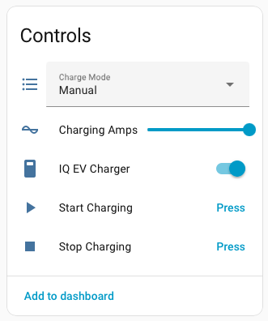
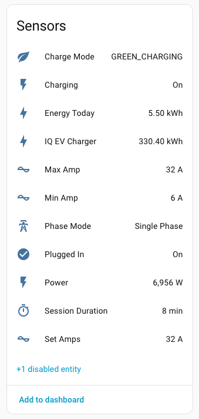
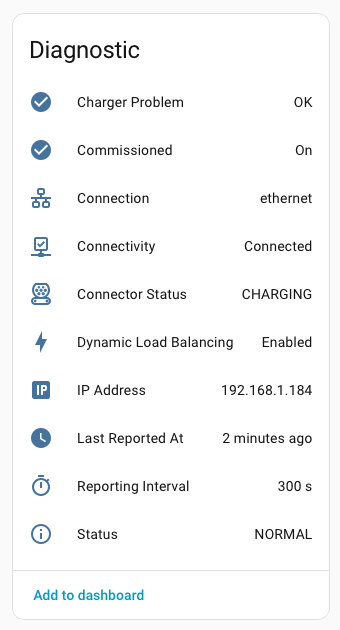

# Enphase EV Charger 2 (Cloud) — Home Assistant Custom Integration

Cloud-based Home Assistant integration for the Enphase IQ EV Charger 2 using the same Enlighten endpoints as the Enphase mobile app.

## Key features

- Start/stop charging while respecting Manual/Scheduled/Green charge modes
- Set and persist charger current limits with automatic clamping
- Live plugged-in/charging state plus charger-problem status
- Power and last-session energy metrics without daily resets
- Connection diagnostics (interface, IP address, reporting cadence)

Localized strings cover English (default plus US, Canada, Australia, New Zealand, and Ireland variants), French, German, Spanish, Italian, Dutch, Swedish, Danish, Finnish, Norwegian Bokmal, Polish, Greek, Romanian, Czech, Hungarian, Bulgarian, Latvian, Lithuanian, Estonian, and Brazilian Portuguese.

## Screenshots

## Quick install (HACS)

1. HACS -> Integrations -> Enphase EV Charger 2 (Cloud)
2. Install and restart Home Assistant
3. Add the integration and sign in

Manual install steps: see the wiki Installation page.

## Authentication

Sign in with your Enlighten credentials; MFA is supported. See the wiki for details.

## Documentation

- Wiki home: https://github.com/barneyonline/ha-enphase-ev-charger/wiki
- Installation: https://github.com/barneyonline/ha-enphase-ev-charger/wiki/Installation
- Authentication: https://github.com/barneyonline/ha-enphase-ev-charger/wiki/Authentication
- Entities and Services: https://github.com/barneyonline/ha-enphase-ev-charger/wiki/Entities-and-Services
- Troubleshooting: https://github.com/barneyonline/ha-enphase-ev-charger/wiki/Troubleshooting
- Technical Reference: https://github.com/barneyonline/ha-enphase-ev-charger/wiki/Technical-Reference
