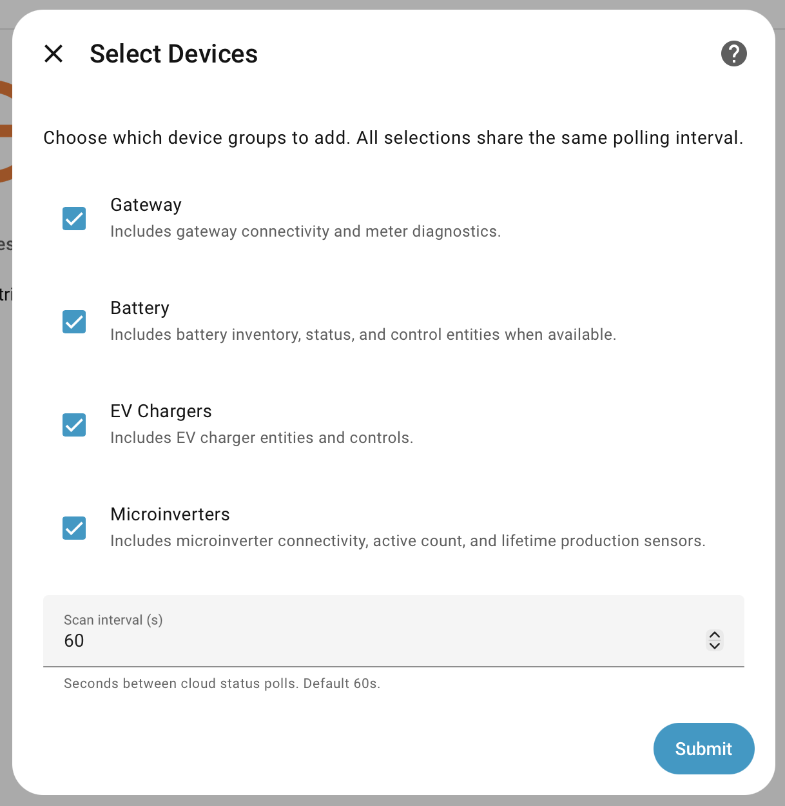
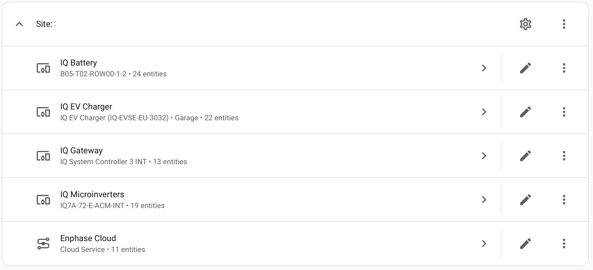
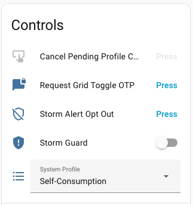
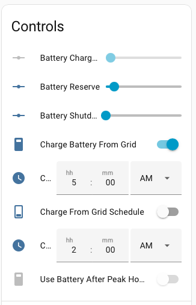
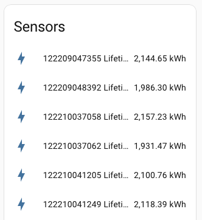
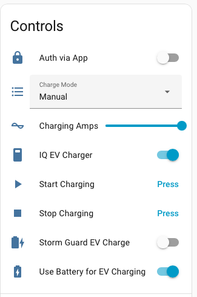
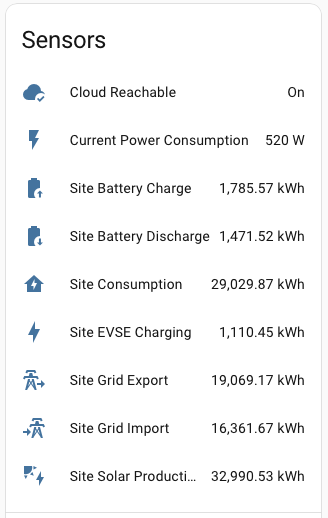

# Enphase Energy — Home Assistant Custom Integration

<!-- Badges -->

Cloud-based Home Assistant integration for Enphase Energy systems.

> [!IMPORTANT]
> This is an unofficial community project. It is not affiliated with, endorsed by, or supported by Enphase Energy.
>
> The integration relies on undocumented Enphase APIs. Those APIs may change or stop working without notice, which can break features until the integration is updated.

## Supported device categories

- IQ Gateway / System Controller entities and controls
- IQ Battery telemetry and BatteryConfig controls (where supported)
- IQ EV Charger controls and session telemetry
- IQ Microinverter connectivity, inventory, and lifetime production telemetry
- Site and cloud energy telemetry (including supported HEMS channels such as Heat Pump and Water Heater lifetime energy)

## Key features

- Guided onboarding for site selection and device-category enablement
- Unified support for EV chargers, gateway, battery, and microinverter entities
- EV charging controls and session telemetry, including charge-mode aware behavior
- Advisory firmware update entities for gateway and EV charger devices with locale-aware release-note links
- Heat-pump runtime status, connectivity, SG-Ready mode, power, and current-day consumption details sourced from HEMS endpoints
- Site and battery energy telemetry, including derived grid-import, grid-export, and battery power sensors for Home Assistant Energy Dashboard use
- Health diagnostics, service-availability tracking, and actionable repair issues
- Broad localization support across all user-facing integration strings

Localized strings cover English (default plus US, Canada, Australia, New Zealand, and Ireland variants), French, German, Spanish, Italian, Dutch, Swedish, Danish, Finnish, Norwegian Bokmal, Polish, Greek, Romanian, Czech, Hungarian, Bulgarian, Latvian, Lithuanian, Estonian, and Brazilian Portuguese.

## Screenshots

Screenshots below are from a mixed Enphase site and show multiple supported device categories.

<picture>
  <source media="(prefers-color-scheme: dark)" srcset="docs/images/setup-dark.png">
  <source media="(prefers-color-scheme: light)" srcset="docs/images/setup-light.png">
  
</picture>

<picture>
  <source media="(prefers-color-scheme: dark)" srcset="docs/images/devices-dark.png">
  <source media="(prefers-color-scheme: light)" srcset="docs/images/devices-light.png">
  
</picture>

<picture>
  <source media="(prefers-color-scheme: dark)" srcset="docs/images/gateway-controls-dark.png">
  <source media="(prefers-color-scheme: light)" srcset="docs/images/gateway-controls-light.png">
  
</picture>

<picture>
  <source media="(prefers-color-scheme: dark)" srcset="docs/images/battery-controls-dark.png">
  <source media="(prefers-color-scheme: light)" srcset="docs/images/battery-controls-light.png">
  
</picture>

<picture>
  <source media="(prefers-color-scheme: dark)" srcset="docs/images/microinverters-sensors-dark.png">
  <source media="(prefers-color-scheme: light)" srcset="docs/images/microinverters-sensors-light.png">
  
</picture>

<picture>
  <source media="(prefers-color-scheme: dark)" srcset="docs/images/charger-controls-dark.png">
  <source media="(prefers-color-scheme: light)" srcset="docs/images/charger-controls-light.png">
  
</picture>

<picture>
  <source media="(prefers-color-scheme: dark)" srcset="docs/images/cloud-sensors-dark.png">
  <source media="(prefers-color-scheme: light)" srcset="docs/images/cloud-sensors-light.png">
  
</picture>

## Quick install (HACS)

1. HACS -> Integrations -> Enphase Energy
2. Install and restart Home Assistant
3. Add the integration and sign in

Manual install steps: see the wiki Installation page.

## Compatibility

- Minimum supported Home Assistant version is `2024.12.0` (Python `3.13`+).
- In v2.0.0, the integration display name changed to `Enphase Energy`.
- The integration domain remains `enphase_ev`, so existing entity IDs, automations, and scripts do not require migration.
- Users migrating from the core Enphase Envoy integration can optionally use the `Migrate Envoy history` assistant in the integration Options flow to take over compatible Energy-dashboard entity IDs. The assistant archives the migrated Envoy energy entities, swaps the entity IDs, and restores the remaining Envoy entities after the migration. Create a full Home Assistant backup first. Full steps: [Envoy History Migration](https://github.com/barneyonline/ha-enphase-energy/wiki/Envoy-History-Migration).

## Authentication

Sign in with your Enlighten credentials; MFA is supported. See the wiki for details.

## Documentation

Refer to the [Wiki](https://github.com/barneyonline/ha-enphase-energy/wiki), including [Envoy History Migration](https://github.com/barneyonline/ha-enphase-energy/wiki/Envoy-History-Migration) for preserving Energy dashboard history when migrating from Enphase Envoy.
