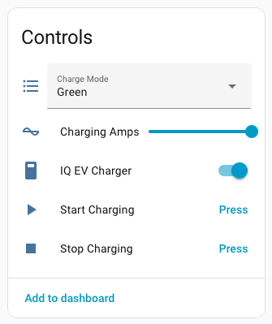

# Enphase EV Charger 2 (Cloud) — Home Assistant Custom Integration

<!-- Badges -->
[](https://github.com/barneyonline/ha-enphase-ev-charger/releases)
[](https://github.com/barneyonline/ha-enphase-ev-charger/stargazers)
[](LICENSE)

[](https://github.com/barneyonline/ha-enphase-ev-charger/actions/workflows/tests.yml)
[](https://codecov.io/gh/barneyonline/ha-enphase-ev-charger)
[](https://github.com/barneyonline/ha-enphase-ev-charger/actions/workflows/hassfest.yml)

[](https://developers.home-assistant.io/docs/integration_quality_scale_index)
[](https://hacs.xyz)

[](https://github.com/barneyonline/ha-enphase-ev-charger/issues)

This custom integration surfaces the **Enphase IQ EV Charger 2** in Home Assistant using the same **Enlighten cloud** endpoints used by the Enphase mobile app and adds:

- Start/stop charging directly from Home Assistant while respecting your Manual/Scheduled/Green charge mode preferences
- Set and persist the charger’s current limit, auto-clamped to the charger’s supported amp range
- View plugged-in and charging state in real time, plus a charger-problem flag exposed as a status attribute
- Track live power plus last-session energy and duration without daily resets
- Inspect connection diagnostics (active interface, IP address) plus last-reported timing and reporting interval attributes

All strings (config flow, entities, diagnostics, and options) are localized in English, French, German, Spanish, and Brazilian Portuguese.

## Screenshots




## Installation

Recommended: HACS
1. In Home Assistant, open **HACS → Integrations**.
2. Search for **Enphase EV Charger 2 (Cloud)**.
3. Open the integration listing and click **Download/Install**.
4. Restart Home Assistant.
5. Go to **Settings → Devices & Services → + Add Integration → Enphase EV Charger 2 (Cloud)** and follow the prompts.

Alternative: Manual copy
1. Download the latest release asset (`enphase_ev.zip`) from [GitHub Releases](https://github.com/barneyonline/ha-enphase-ev-charger/releases) and extract it.
2. Copy the extracted `custom_components/enphase_ev/` folder into your Home Assistant `config/custom_components/` directory.
3. Restart Home Assistant.
4. Add the integration via **Settings → Devices & Services → + Add Integration → Enphase EV Charger 2 (Cloud)**.

## Authentication

**Preferred: Sign in with Enlighten credentials**

1. In Home Assistant, go to **Settings → Devices & Services → + Add Integration** and pick **Enphase EV Charger 2 (Cloud)**.
2. Enter the Enlighten email address and password that you use at https://enlighten.enphaseenergy.com/.
3. (Optional) Enable **Remember password** if you want Home Assistant to re-use it for future re-authentications.
4. If prompted, enter the one-time code from the Enphase MFA challenge (email or SMS); use the resend option if you need a new code.
5. After login, select your site and tick the chargers you want to add, then finish the flow.

## Entities & Services

### Charger entities

| Sensor Name | Sensor Type | Entity ID | Description | Attribute(s) |
| --- | --- | --- | --- | --- |
| Connectivity | Binary Sensor | `binary_sensor.<charger_name>_connectivity` | Connectivity state from the status snapshot; attributes from summary v2. | `connection`<br>`ip_address` |
| Plugged In | Binary Sensor | `binary_sensor.<charger_name>_plugged_in` | Plugged-in state from the status snapshot. | None |
| Charging | Binary Sensor | `binary_sensor.<charger_name>_charging` | Charging state with connector status normalization. | None |
| Electrical Phase | Sensor | `sensor.<charger_name>_electrical_phase` | Phase mode with DLB indicators. | `phase_mode_raw`<br>`dlb_enabled`<br>`dlb_active` |
| Connector Status | Sensor | `sensor.<charger_name>_connector_status` | Connector status from the status snapshot. | `status_reason`<br>`connector_status_info` |
| Charge Mode | Sensor | `sensor.<charger_name>_charge_mode` | Active charge mode (manual/scheduled/green). | None |
| Set Amps | Sensor | `sensor.<charger_name>_set_amps` | Configured charge current setpoint. | `min_amp`<br>`max_amp`<br>`max_current`<br>`amp_granularity` |
| Power | Sensor | `sensor.<charger_name>_power` | Derived power from lifetime energy deltas. | `last_lifetime_kwh`<br>`last_energy_ts`<br>`last_sample_ts`<br>`last_power_w`<br>`last_window_seconds`<br>`method`<br>`charging`<br>`operating_v`<br>`max_throughput_w`<br>`max_throughput_unbounded_w`<br>`max_throughput_source`<br>`max_throughput_amps`<br>`max_throughput_voltage`<br>`last_reset_at` |
| Last Session | Sensor | `sensor.<charger_name>_last_session` | Most recent or active session totals and metadata. | `energy_consumed_wh`<br>`energy_consumed_kwh`<br>`session_cost`<br>`session_charge_level`<br>`range_added`<br>`plugged_in_at`<br>`plugged_out_at`<br>`session_duration_min`<br>`session_id`<br>`session_started_at`<br>`session_ended_at`<br>`active_charge_time_s`<br>`avg_cost_per_kwh`<br>`cost_calculated`<br>`session_cost_state`<br>`manual_override`<br>`charge_profile_stack_level` |
| Lifetime Energy | Sensor | `sensor.<charger_name>_lifetime_energy` | Lifetime energy total. | `last_reset_value`<br>`last_reset_at` |
| Last Reported At | Sensor | `sensor.<charger_name>_last_reported` | Last report timestamp for the charger. | `reporting_interval` |
| Status | Sensor | `sensor.<charger_name>_status` | Summary status with commission/fault/pause context. | `commissioned`<br>`charger_problem`<br>`suspended_by_evse`<br>`offline_since` |

### Site entities

| Sensor Name | Sensor Type | Entity ID | Description | Attribute(s) |
| --- | --- | --- | --- | --- |
| Cloud Reachable | Binary Sensor | `binary_sensor.enphase_site_<site_id>_cloud_reachable` | Cloud reachability derived from coordinator success timing. | `last_success_utc`<br>`last_failure_utc`<br>`last_failure_status`<br>`code_description`<br>`last_failure_response`<br>`last_failure_source`<br>`backoff_ends_utc` |
| Last Successful Update | Sensor | `sensor.enphase_site_<site_id>_last_successful_update` | Last successful update timestamp. | `last_success_utc`<br>`last_failure_utc`<br>`last_failure_status`<br>`code_description`<br>`last_failure_response`<br>`last_failure_source`<br>`backoff_ends_utc` |
| Cloud Latency | Sensor | `sensor.enphase_site_<site_id>_cloud_latency` | Last request latency in ms. | `last_success_utc`<br>`last_failure_utc`<br>`last_failure_status`<br>`code_description`<br>`last_failure_response`<br>`last_failure_source`<br>`backoff_ends_utc` |
| Cloud Error Code | Sensor | `sensor.enphase_site_<site_id>_cloud_error_code` | Last failure status or network error code. | `last_success_utc`<br>`last_failure_utc`<br>`last_failure_status`<br>`code_description`<br>`last_failure_response`<br>`last_failure_source`<br>`backoff_ends_utc` |
| Cloud Backoff Ends | Sensor | `sensor.enphase_site_<site_id>_cloud_backoff_ends` | Backoff end timestamp for cloud retries. | `last_success_utc`<br>`last_failure_utc`<br>`last_failure_status`<br>`code_description`<br>`last_failure_response`<br>`last_failure_source`<br>`backoff_ends_utc` |
| Site Solar Production | Sensor | `sensor.enphase_site_<site_id>_site_solar_production` | Lifetime solar production (disabled by default). | `start_date`<br>`last_report_date`<br>`bucket_count`<br>`source_fields`<br>`source_unit`<br>`interval_minutes`<br>`last_reset_at`<br>`update_pending` |
| Site Consumption | Sensor | `sensor.enphase_site_<site_id>_site_consumption` | Lifetime site consumption (disabled by default). | `start_date`<br>`last_report_date`<br>`bucket_count`<br>`source_fields`<br>`source_unit`<br>`interval_minutes`<br>`last_reset_at`<br>`update_pending` |
| Site Grid Import | Sensor | `sensor.enphase_site_<site_id>_site_grid_import` | Lifetime grid import (disabled by default). | `start_date`<br>`last_report_date`<br>`bucket_count`<br>`source_fields`<br>`source_unit`<br>`interval_minutes`<br>`last_reset_at`<br>`update_pending` |
| Site Grid Export | Sensor | `sensor.enphase_site_<site_id>_site_grid_export` | Lifetime grid export (disabled by default). | `start_date`<br>`last_report_date`<br>`bucket_count`<br>`source_fields`<br>`source_unit`<br>`interval_minutes`<br>`last_reset_at`<br>`update_pending` |
| Site Battery Charge | Sensor | `sensor.enphase_site_<site_id>_site_battery_charge` | Lifetime battery charge (disabled by default). | `start_date`<br>`last_report_date`<br>`bucket_count`<br>`source_fields`<br>`source_unit`<br>`interval_minutes`<br>`last_reset_at`<br>`update_pending` |
| Site Battery Discharge | Sensor | `sensor.enphase_site_<site_id>_site_battery_discharge` | Lifetime battery discharge (disabled by default). | `start_date`<br>`last_report_date`<br>`bucket_count`<br>`source_fields`<br>`source_unit`<br>`interval_minutes`<br>`last_reset_at`<br>`update_pending` |

### Controls

| Control Name | Entity Type | Entity ID | Description |
| --- | --- | --- | --- |
| Charging | Switch | `switch.<charger_name>_charging` | Per-charger on/off control that respects the configured charge mode. |
| Start Charging | Button | `button.<charger_name>_start_charging` | Start a charging session using the active charge mode preference. |
| Stop Charging | Button | `button.<charger_name>_stop_charging` | Stop the active charging session. |
| Charge Mode | Select | `select.<charger_name>_charge_mode` | Set Manual, Scheduled, or Green charge mode via the scheduler. |
| Charging Amps | Number | `number.<charger_name>_charging_amps` | Set charging amps without starting a session; clamped to charger limits. |

Sites without chargers can still be added in **site-only** mode to keep the site device and lifetime energy sensors active.

**Services (Actions)**

| Action | Description | Fields |
| --- | --- | --- |
| `enphase_ev.start_charging` | Start charging for the charger(s) selected via the service target (supports multiple devices) while preserving the charger’s Manual/Scheduled/Green mode. | Advanced fields: `charging_level` (optional A; defaults to the stored/last session amps and is clamped to the charger limits), `connector_id` (optional; defaults to 1) |
| `enphase_ev.stop_charging` | Stop charging on the charger(s) selected via the service target. | None |
| `enphase_ev.trigger_message` | Request the selected charger(s) to send an OCPP message and return the cloud response. | `requested_message` (required; e.g. `MeterValues`). Advanced: `site_id` (optional override) |
| `enphase_ev.clear_reauth_issue` | Clear the integration’s reauthentication repair for the chosen site device(s). | `site_id` (optional override) |
| `enphase_ev.start_live_stream` | Request faster cloud status updates for a short period. | Advanced fields: `site_id` (optional; stream a specific site) |
| `enphase_ev.stop_live_stream` | Stop the cloud live stream request. | Advanced fields: `site_id` (optional; stop streaming for a specific site) |

- The `Last Session` sensor exposes localized session metadata attributes (plug-in/out timestamps, energy consumed in kWh/Wh, duration, cost, charge level, and range added) and preserves the latest completed/active session totals across days and restarts.

## Privacy & Rate Limits

- Credentials are stored in HA’s config entries and redacted from diagnostics.
- The integration polls `/status` every 30 seconds by default (configurable).  
- Uses the Enlighten login flow to obtain session headers and refreshes them automatically when the password is stored.

## Future Local Path

> ⚠️ Local-only access to EV endpoints is **role-gated** on IQ Gateway firmware 7.6.175. The charger surfaces locally under `/ivp/pdm/*` or `/ivp/peb/*` only with **installer** scope. This integration therefore uses the **cloud API** until owner-scope local endpoints are available.

When Enphase exposes owner-scope EV endpoints locally, we can add a local client and prefer it automatically. For now, local `/ivp/pdm/*` and `/ivp/peb/*` returned 401 in discovery.

---

### Troubleshooting

- **401 Unauthorized**: Open the integration options and choose **Start reauthentication** to refresh credentials.  
- **No entities**: Check that your serial is present in `/status` response (`evChargerData`), and matches the configured serial.  
- **Rate limiting**: Increase `scan_interval` to 30s or more.
- **wrong_account**: The reconfigure flow stays tied to the site that was originally configured. Remove and re-add the integration if you need to link a different site/account.

### Documentation

- API reference notes: `docs/api/`
- Screenshot assets for the README: `docs/images/`

### Development

The repository also includes a ready-to-use Docker setup under `devtools/docker/` for reproducible testing:

```bash
# Build the dev image
docker compose -f devtools/docker/docker-compose.yml build ha-dev

# Run the full test suite
docker compose -f devtools/docker/docker-compose.yml run --rm ha-dev bash -lc "pytest tests/components/enphase_ev"

# Run pre-commit hooks
docker compose -f devtools/docker/docker-compose.yml run --rm ha-dev bash -lc "pre-commit run --all-files"
```

### Options

- Polling intervals: Configure slow (idle) and fast (charging) intervals. The integration auto‑switches and also uses a short fast window plus a brief live‑stream burst after Start/Stop to reflect changes faster.
- API timeout: Default 15s (Options → API timeout).
- Nominal voltage: Default 240 V; used to estimate power from amps when the API omits power.
- Fast while streaming: On by default; prefers faster polling while an explicit cloud live stream is active.
- Site-only mode: Skip charger polling when your site has no chargers; keeps the site device and lifetime energy sensors active.

### System Health & Diagnostics

- System Health (Settings → System → Repairs → System Health):
  - Site ID: your configured site identifier
  - Can reach server: live reachability to Enlighten cloud
  - Last successful update: timestamp of most recent poll
  - Cloud latency: round‑trip time for the last status request
- Diagnostics: Downloaded JSON excludes sensitive headers (`e-auth-token`, `Cookie`) and other secrets.

### Energy Dashboard

- Site-level energy sensors (disabled by default) map directly to Energy Dashboard slots:
  - Grid Consumption → `Site Grid Import`
  - Return to Grid → `Site Grid Export`
  - Solar Production → `Site Solar Production`
  - Battery Charge / Discharge → `Site Battery Charge` and `Site Battery Discharge`
- `Site Consumption` is available for total usage tracking and custom dashboards, but it is not required by the Energy Dashboard.
- These sensors live on the Site device with `device_class: energy`, `state_class: total_increasing`, and kWh units, and they track lifetime totals with reset guards.
- The charger `Lifetime Energy` sensor remains available for per-charger consumption tracking if you prefer.

### Behaviours

| Connector Status | Meaning |
| --- | --- |
| AVAILABLE | Charger is idle and ready; no vehicle is drawing power. The integration treats this as the non-charging baseline. |
| CHARGING | Energy is flowing to the EV; the session is marked as active. |
| FINISHING | Charger is tapering a completed session while the vehicle remains plugged in; still considered active until the plug is removed. |
| SUSPENDED | Firmware-reported pause while the session remains logically active (for example, balancing or awaiting confirmation). Charging remains true so automations stay active. |
| SUSPENDED_EV | The vehicle requested a pause (typical OCPP behaviour). Because power can resume without a new session, Home Assistant continues to show an “active” charging posture. |
| SUSPENDED_EVSE | The charger itself paused delivery (load management, scheduling, insufficient solar, etc.). The coordinator records `suspended_by_evse = True` and flips `charging` to false so dashboards show a paused session. |
| FAULTED | Hardware or safety fault; user action or service intervention is required. The connector status sensor maps this to an alert icon for visibility. |

- The Connector Status sensor exposes a `Status Reason` attribute mirroring Enlighten's `connectorStatusReason` value (for example, `INSUFFICIENT_SOLAR`) so automations can react to the underlying pause cause.

- Charging Amps (number) stores your desired setpoint but does not start charging. The Start button, Charging switch, or start service will reuse that stored/last session value, clamp it to the charger’s supported range, and fall back to 32 A when the backend provides no hints. When you adjust the number during an active session, the integration automatically pauses charging, waits ~30 seconds, and restarts with the new amps so the updated limit sticks.
- Start/Stop actions require the EV to be plugged in; unplugged requests raise a validation error so the UI prompts to connect before trying again.
- Backend responses that report the charger as “not ready” or “not plugged” are treated as benign no-ops without optimistic state changes, keeping Home Assistant in sync with the hardware.
- Charging state tracks the backend `charging` flag while EVSE-side suspensions (`SUSPENDED_EVSE`) are treated as paused; when you previously requested charging, the integration automatically re-sends the start command after reconnecting so cloud dropouts and Home Assistant restarts resume charging without manual intervention.
- The Charge Mode select works with the scheduler API and reflects the service’s active mode.
- When you start charging from the switch, buttons, or start service, the integration enforces the active charge mode: Manual sends the explicit amps payload, Scheduled ensures the scheduler stays enabled, and Green omits the charging level so solar-only behaviour is preserved.

### Reconfigure

- You can reconfigure the integration (switch sites, update charger selection, or refresh credentials) without removing it.
- Go to Settings → Devices & Services → Integrations → Enphase EV Charger 2 (Cloud) → Reconfigure, then sign in with your Enlighten credentials.
- The wizard skips the site selector when reconfiguring and will abort with `wrong_account` if you try to switch to a different site; remove and add the integration again to change sites.
- Stored passwords pre-fill automatically; otherwise you will be asked to provide them during the flow.

### Supported devices

- Supported
  - Enphase IQ EV Charger 2 variants (single-connector), as exposed via Enlighten cloud.
- Unsupported / not tested
  - Earlier charger generations or models not exposed by the Enlighten EV endpoints.
  - Multi-connector or region-specific variants not returning compatible status/summary payloads.

### Removing the integration

- Go to Settings → Devices & Services → Integrations.
- Locate “Enphase EV Charger 2 (Cloud)” and choose “Delete” to remove the integration and its devices.
- If installed via HACS, you may also remove the repository entry from HACS after removal.
