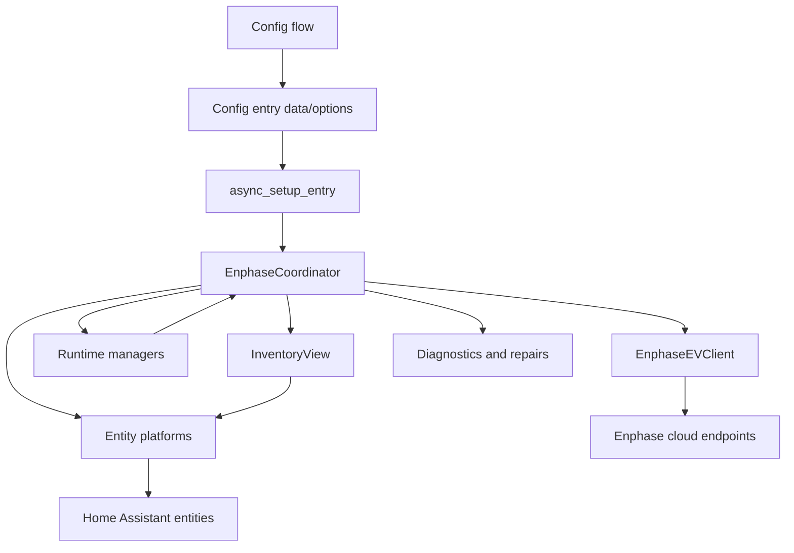
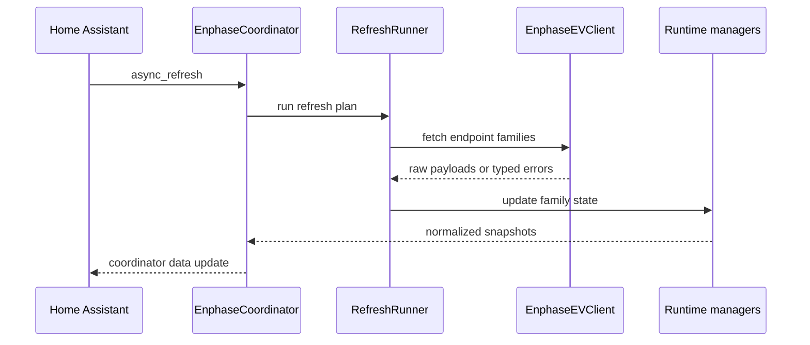

# Architecture

This document is a contributor map for the Enphase Energy integration. It explains where behavior lives and how the main pieces interact. For domain terms, see the [glossary](glossary.md).

## Runtime Shape

Each Home Assistant config entry owns one `EnphaseCoordinator`. The coordinator is the integration boundary for entities: platforms read normalized state from the coordinator and call coordinator/service helpers for writes. Entities should not call the cloud client directly unless a local helper already establishes that pattern.

## Setup And Authentication

`config_flow.py` handles user login, MFA, site selection, device-category selection, reconfigure, and reauth entry updates. It stores the tokens and cookies needed for refreshes in the config entry. The password is stored only when the user opts into remembered credentials so the integration can attempt automatic token refresh.

`__init__.py` handles config entry setup and unload. It creates the coordinator, starts schedule sync and platform setup, registers services, and keeps the Home Assistant device and entity registries aligned with current inventory. Registry cleanup is intentionally conservative and waits for inventory readiness so transient cloud discovery failures do not remove user-customized entities.

## Coordinator And Refresh Flow

`coordinator.py` owns polling cadence, auth refresh coordination, endpoint health, backoff state, runtime managers, and normalized integration state. `refresh_plan.py` defines which endpoint families are refreshed in each phase. `refresh_runner.py` executes those plans and isolates optional endpoint failures so one unhealthy Enphase service does not fail the whole coordinator refresh.

The coordinator distinguishes core failures from optional endpoint failures:

- Auth failures can trigger Home Assistant reauth or an auth-block repair issue.
- Rate limits and cloud outages enter bounded backoff and expose diagnostic sensors.
- Optional endpoint failures mark that family stale, preserve recent useful data where safe, and report repairs when needed.

## Cloud Client

`api.py` is the HTTP boundary. It handles Enlighten login, MFA, credential refresh helpers, request headers, response parsing, invalid payload signatures, and endpoint-specific compatibility paths.

Several Enphase surfaces behave like browser-backed applications rather than stable public APIs:

- Enlighten pages and XHR endpoints need browser-like headers and cookies.
- BatteryConfig has multiple auth/header/XSRF shapes depending on site, region, and firmware.
- Scheduler and EVSE control endpoints can accept writes before read endpoints reflect the new state.
- Some optional endpoints return HTML, login pages, or non-JSON success responses.

Keep new endpoint handling inside `api.py` or narrow parser/helper modules so coordinator and entity code remain normalized.

## Runtime Managers

Runtime managers keep endpoint-family behavior out of the main coordinator:

- `battery_runtime.py` handles BatteryConfig controls, profile state, schedules, pending writes, and battery diagnostics payloads.
- `evse_runtime.py` handles charger commands, fast polling, streaming, charge-mode cache, auth settings, and EVSE control side effects.
- `inventory_runtime.py` handles topology, type buckets, HEMS inventory, and system-dashboard payloads.
- `heatpump_runtime.py` handles HEMS heat-pump runtime state, daily consumption, and diagnostics snapshots.
- `current_power_runtime.py`, `evse_feature_flags_runtime.py`, `auth_refresh_runtime.py`, and `ac_battery_runtime.py` handle smaller endpoint families.

These managers should own cache lifetimes, stale data decisions, and endpoint-specific parsing for their family. The coordinator should expose their normalized state through properties and helper methods.

## Inventory And Entity Gating

`inventory_runtime.py` builds type buckets from cloud inventory. `inventory_view.py` is the read-facing layer used by entity platforms to decide whether a type should exist or be available. `device_types.py` normalizes Enphase product labels into canonical type keys.

Entity platforms under `sensor.py`, `binary_sensor.py`, `button.py`, `number.py`, `select.py`, `switch.py`, `time.py`, `calendar.py`, and `update.py` create Home Assistant entities from coordinator state. Platform setup usually follows this pattern:

1. Add site-level entities that are supported by selected inventory types and permissions.
2. Add charger or device entities for discovered serials/type members.
3. Wait for inventory readiness before pruning managed entity registry entries.
4. Use optimistic coordinator caches only when Enphase writes are known to settle asynchronously.

## Diagnostics, Redaction, And Repairs

`diagnostics.py` builds Home Assistant config-entry and device diagnostics. `coordinator_diagnostics.py` builds coordinator health snapshots and manages repair issues. `log_redaction.py` and `runtime_helpers.redact_battery_payload` are the shared redaction helpers.

Diagnostics may include raw or near-raw Enphase payloads after redaction. Any new diagnostics payload should be reviewed for:

- Tokens, cookies, credentials, emails, user IDs, and auth headers.
- Site IDs, serials, device UIDs, MAC addresses, IP addresses, hostnames, URLs, and modem/SIM identifiers.
- Nested payloads where future fields may add identifiers.

When in doubt, redact broadly and expose counts, status summaries, field names, or shape summaries instead of raw values.

## Schedule Editing And Sync

EVSE schedules use Home Assistant schedule helpers through `schedule_sync.py`. The sync layer mirrors Enphase scheduler slots into helper entities and pushes helper changes back to Enphase. It keeps server timestamps as optimistic concurrency metadata and refreshes shortly after writes because scheduler reads can lag writes.

Battery schedule editing is separate and lives in `battery_schedule_editor.py`. It normalizes BatteryConfig schedule families (`cfg`, `dtg`, `rbd`) into one editor model while preserving schedule type, days, limits, and fallback state from coordinator scalar fields.

`schedule.py` normalizes EVSE slot payloads before scheduler writes. Preserve unknown or scheduler-owned fields unless there is a specific reason to drop them; Enphase PATCH endpoints often expect more than the fields directly edited by the UI.

## Adding New Behavior

Use this starting-point map:

- New cloud endpoint: start in `api.py`, then add a parser/helper if payload normalization is non-trivial.
- New endpoint family state: add or extend a runtime manager, then expose normalized coordinator properties.
- New entity: add the entity in the relevant platform and gate it through `InventoryView` or existing coordinator capability flags.
- New diagnostic payload: add redaction first, then add summaries or payload copies.
- New user-facing string: update `strings.json`, every locale file under `translations/`, and translation tests when applicable.
- New control action: route through coordinator/runtime helpers, translate validation failures, and update optimistic caches only when the Enphase read-after-write behavior requires it.

## Testing Pointers

Keep tests close to the changed behavior under `tests/components/enphase_ev/`.

- Coordinator refresh and endpoint health: `test_coordinator_*.py`, `test_rate_limit_and_switch_kick.py`, `test_latency_and_connectivity.py`.
- API client and parsers: `test_api_*.py`, `test_session_history_parsers.py`, `test_evse_timeseries.py`, `test_site_energy.py`.
- Entity setup and cleanup: `test_entity_*.py`, `test_device_info.py`, `test_inventory_runtime.py`.
- Battery controls and schedules: `test_battery_*.py`, `test_battery_schedule_editor_parity.py`.
- EVSE controls and schedules: `test_evse_*.py`, `test_select_charge_mode.py`, `test_schedule_sync.py`.
- Diagnostics and redaction: `test_diagnostics*.py`, `test_log_redaction.py`, `test_payload_debug.py`.

Use the pinned Docker commands from `CONTRIBUTING.md` for validation.
