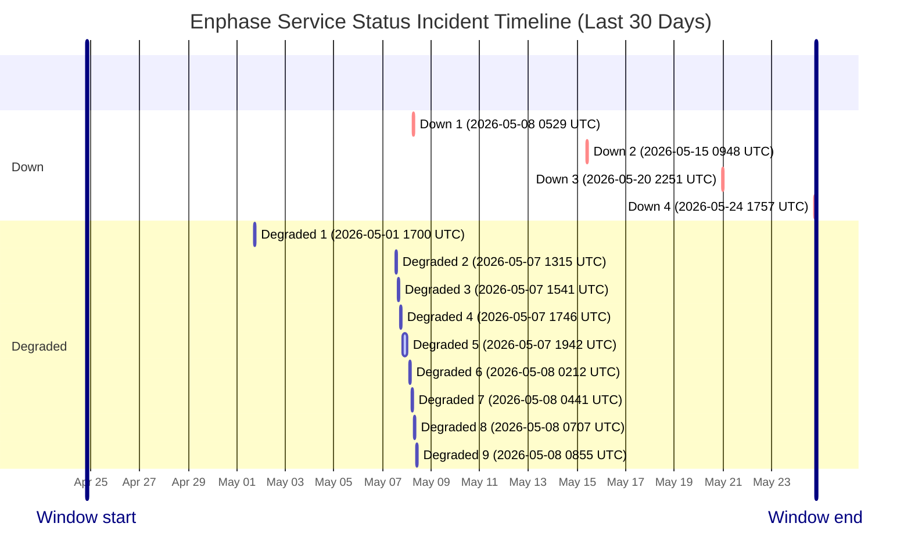

# Service Status History

- Current status: **Fully Operational**
- Last updated: `2026-05-24 19:23 UTC`
- Failed checks in latest run: `1`
- Latest failed checks: battery_config
- Retained hourly samples: `387`
- Incident windows in last 30 days: `13`

This page is generated from hourly synthetic checks against Enphase cloud endpoints. It may miss incidents that begin and recover between checks.

## Incident Timeline

## Incident Summary

| Status | Started (UTC) | Ended (UTC) | Duration | Failed checks |
| --- | --- | --- | --- | --- |
| Degraded | 2026-05-01 17:00 UTC | Unknown after last seen 2026-05-01 17:00 UTC | Observed 0m | battery_config, evse_scheduler, site_live |
| Degraded | 2026-05-07 13:15 UTC | Unknown after last seen 2026-05-07 13:15 UTC | Observed 0m | battery_config, evse_scheduler |
| Degraded | 2026-05-07 15:41 UTC | Unknown after last seen 2026-05-07 15:41 UTC | Observed 0m | battery_config, evse_scheduler, site_live |
| Degraded | 2026-05-07 17:46 UTC | Unknown after last seen 2026-05-07 17:46 UTC | Observed 0m | battery_config, evse_scheduler |
| Degraded | 2026-05-07 19:42 UTC | 2026-05-07 23:52 UTC | 4h 9m | battery_config, evse_scheduler |
| Degraded | 2026-05-08 02:12 UTC | Unknown after last seen 2026-05-08 02:50 UTC | Observed 37m | battery_config, battery_runtime, discovery, evse_scheduler, inventory, microinverters, site_energy, site_live, system_dashboard_details, system_dashboard_tree |
| Degraded | 2026-05-08 04:41 UTC | 2026-05-08 05:29 UTC | 48m | battery_config, evse_scheduler |
| Down | 2026-05-08 05:29 UTC | Unknown after last seen 2026-05-08 05:29 UTC | Observed 0m | battery_config, evse_runtime |
| Degraded | 2026-05-08 07:07 UTC | Unknown after last seen 2026-05-08 07:07 UTC | Observed 0m | battery_config, evse_scheduler |
| Degraded | 2026-05-08 08:55 UTC | 2026-05-08 10:23 UTC | 1h 28m | battery_config, evse_scheduler |
| Down | 2026-05-15 09:48 UTC | Unknown after last seen 2026-05-15 09:48 UTC | Observed 0m | battery_config, battery_runtime, microinverters |
| Down | 2026-05-20 22:51 UTC | 2026-05-21 00:06 UTC | 1h 15m | battery_config, evse_runtime, evse_scheduler |
| Down | 2026-05-24 17:57 UTC | 2026-05-24 19:23 UTC | 1h 26m | battery_config, evse_runtime, evse_scheduler |

## Raw Artifacts

- [Current status.json](https://raw.githubusercontent.com/barneyonline/ha-enphase-energy/service-status/status.json)
- [30-day history.json](https://raw.githubusercontent.com/barneyonline/ha-enphase-energy/service-status/history.json)
- [30-day incidents.json](https://raw.githubusercontent.com/barneyonline/ha-enphase-energy/service-status/incidents.json)

