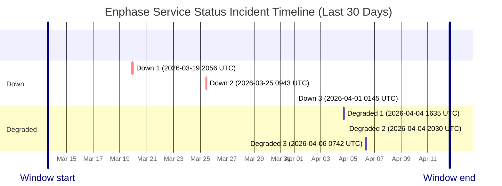

# Service Status History

- Current status: **Fully Operational**
- Last updated: `2026-04-12 14:08 UTC`
- Failed checks in latest run: `1`
- Latest failed checks: battery_config
- Retained hourly samples: `577`
- Incident windows in last 30 days: `6`

This page is generated from hourly synthetic checks against Enphase cloud endpoints. It may miss incidents that begin and recover between checks.

## Incident Timeline

## Incident Summary

| Status | Started (UTC) | Ended (UTC) | Duration | Failed checks |
| --- | --- | --- | --- | --- |
| Down | 2026-03-19 20:56 UTC | Unknown after last seen 2026-03-19 23:21 UTC | Observed 2h 25m | charger_status, scheduler_charge_mode, scheduler_green_settings, scheduler_schedules |
| Down | 2026-03-25 09:43 UTC | 2026-03-25 11:34 UTC | 1h 51m | charger_status, scheduler_charge_mode, scheduler_green_settings, scheduler_schedules |
| Down | 2026-04-01 01:45 UTC | Unknown after last seen 2026-04-01 01:45 UTC | Observed 0m | battery_config, evse_runtime, evse_scheduler |
| Degraded | 2026-04-04 16:35 UTC | 2026-04-04 17:28 UTC | 53m | battery_config, evse_scheduler, inventory, site_energy |
| Degraded | 2026-04-04 20:30 UTC | 2026-04-04 21:30 UTC | 59m | battery_config, evse_scheduler |
| Degraded | 2026-04-06 07:42 UTC | 2026-04-06 09:08 UTC | 1h 25m | battery_config, session_history |

## Raw Artifacts

- [Current status.json](https://raw.githubusercontent.com/barneyonline/ha-enphase-energy/service-status/status.json)
- [30-day history.json](https://raw.githubusercontent.com/barneyonline/ha-enphase-energy/service-status/history.json)
- [30-day incidents.json](https://raw.githubusercontent.com/barneyonline/ha-enphase-energy/service-status/incidents.json)

