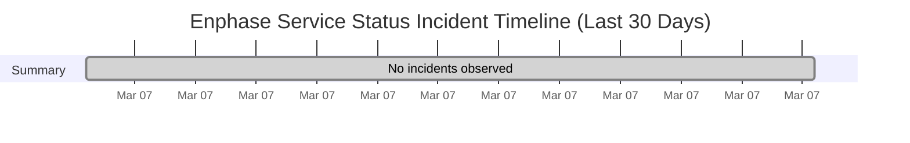

# Service Status History

- Current status: **Fully Operational**
- Last updated: `2026-03-07 12:27 UTC`
- Failed checks in latest run: `0`
- Latest failed checks: None
- Retained hourly samples: `4`
- Incident windows in last 30 days: `0`

This page is generated from hourly synthetic checks against Enphase cloud endpoints. It may miss incidents that begin and recover between checks.

## Incident Timeline

## Incident Summary

No degraded or down incidents observed in the last 30 days.

## Raw Artifacts

- [Current status.json](https://raw.githubusercontent.com/barneyonline/ha-enphase-energy/service-status/status.json)
- [30-day history.json](https://raw.githubusercontent.com/barneyonline/ha-enphase-energy/service-status/history.json)
- [30-day incidents.json](https://raw.githubusercontent.com/barneyonline/ha-enphase-energy/service-status/incidents.json)

