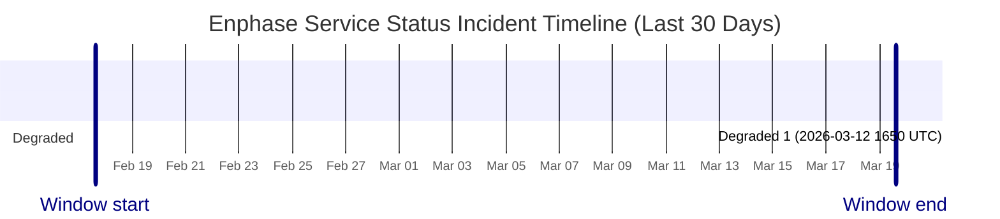

# Service Status History

- Current status: **Fully Operational**
- Last updated: `2026-03-19 14:03 UTC`
- Failed checks in latest run: `0`
- Latest failed checks: None
- Retained hourly samples: `250`
- Incident windows in last 30 days: `1`

This page is generated from hourly synthetic checks against Enphase cloud endpoints. It may miss incidents that begin and recover between checks.

## Incident Timeline

## Incident Summary

| Status | Started (UTC) | Ended (UTC) | Duration | Failed checks |
| --- | --- | --- | --- | --- |
| Degraded | 2026-03-12 16:50 UTC | 2026-03-12 17:42 UTC | 51m | site_discovery_1 |

## Raw Artifacts

- [Current status.json](https://raw.githubusercontent.com/barneyonline/ha-enphase-energy/service-status/status.json)
- [30-day history.json](https://raw.githubusercontent.com/barneyonline/ha-enphase-energy/service-status/history.json)
- [30-day incidents.json](https://raw.githubusercontent.com/barneyonline/ha-enphase-energy/service-status/incidents.json)

